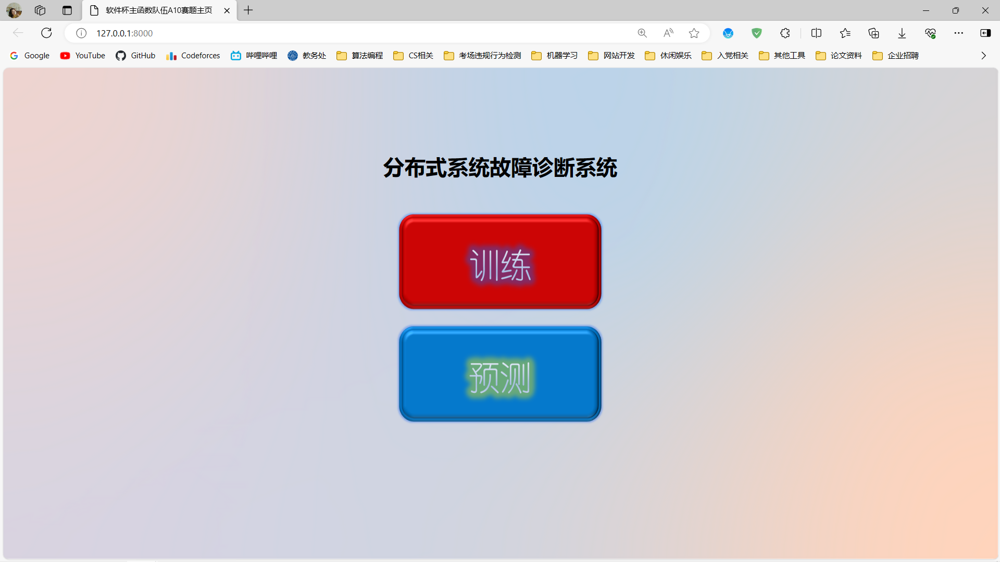

# Fault_Diagnosis_System_Web_for_Softwarecup
A fault diagnosis system web for softwarecup from NUAA. Theme contains Machine Learning and Web Design and Deploy. Database use MySQL, Web frame use Django, Coding language use Python of main, Coding environment in Linux OS. Because of the overtime use of the cloud server, it cannot be interviewd from any IP. For the correct run of the web system in local, ensure the correct running environment(MySQL + Django + Python), then cd /softwarecup_web and terminal input 'python manage.py runserver'(Windows) or 'python3 manage.py runserver'(Linux) in localhost.
